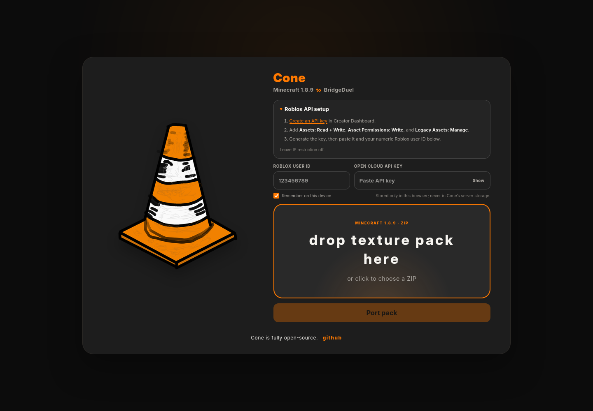

# Cone

Cone ports Minecraft 1.8.9 texture packs to Roblox. It finds supported item and block textures, resizes them to 512×512, creates edge-expanded texture variants, builds greedy-meshed item geometry, uploads the assets through Roblox Open Cloud, and returns the compressed JSON used by the game.



## What it does

- Pure Go mesh generation—no Blender, `bpy`, or Python runtime.
- Greedy meshing that removes transparent background geometry.
- Consistent sword, pickaxe, axe, bow, potion, resource, wool, and utility-item mappings.
- Normal VP images plus edge-expanded texture variants.
- GLB model import with resolution to Roblox `MeshPart.MeshId` assets.
- Responsive local/public web interface with streamed conversion logs.
- Durable bbolt history for every successful port, indexed by Pack ID.
- Reusable image, mesh, GLB, texture-pack, and upload helpers in `utils`.
- Reusable port-history helpers in `packstore`.

## Requirements

- Go 1.22 or newer.
- A Roblox Open Cloud API key with:
  - **Assets: Read + Write**
  - **Asset Permissions: Write**
  - **Legacy Assets: Manage**
- IP restriction left off, unless every Cone server IP is explicitly allowed.

## Run the web interface

```bash
go run . --web
```

Open `http://127.0.0.1:8080`. The browser supplies a Roblox user ID and API key for each conversion. Request credentials are not written to server storage.

To listen on another address:

```bash
AUTOPACK_ADDR=0.0.0.0:8080 go run . --web
```

Use HTTPS whenever the interface is reachable over a network.

Successful web ports are appended to `data/cone.db`. Set
`CONE_DATABASE_PATH` to place the database elsewhere. Cone stores the Pack ID,
original filename, timestamp, and compressed output JSON; it does not store the
uploaded ZIP, Roblox API key, or preview image.

Cone listens directly with Go's HTTP server. nginx is optional; a reverse proxy
or Cloudflare Tunnel can point straight to `http://127.0.0.1:8080`.

## Run from the command line

Copy the example configuration and fill in your own values:

```bash
cp .env_example.go .env.go
go run . /path/to/texture-pack.zip
```

You can use `ROBLOX_API_KEY` and `ROBLOX_USER_ID` environment variables instead. Cone writes `<pack>_cone.json` beside the input ZIP.

## Use the processing library

```go
package main

import (
    "image"

    "github.com/qaustria/AutoPack-Go/utils"
)

func build(img image.Image) ([]byte, error) {
    resized := utils.ResizeTexture(img)
    mesh, _, err := utils.BuildGreedyMesh(resized, utils.DefaultConfig())
    if err != nil {
        return nil, err
    }
    return utils.EncodeGeometryGLB(mesh)
}
```

`utils.EdgeExpand`, `utils.EncodeGLB`, `utils.UnzipTexturePack`, and `utils.NewAssetUploader` are also available for custom pipelines. The `packstore` package can open, save, count, and retrieve port-history records.

## Verify changes

```bash
go test -race ./...
go vet ./...
go build ./...
```

## Raspberry Pi

The repository includes ARMv7 and ARM64 builds used by `deploy-pi.sh`. On the Pi:

```bash
cd ~/AutoPack-Go
git pull --ff-only origin master
./deploy-pi.sh
```

## Security

Never commit `.env.go`. See [SECURITY.md](SECURITY.md) for credential handling and private vulnerability reporting.

## License

[MIT](LICENSE)
